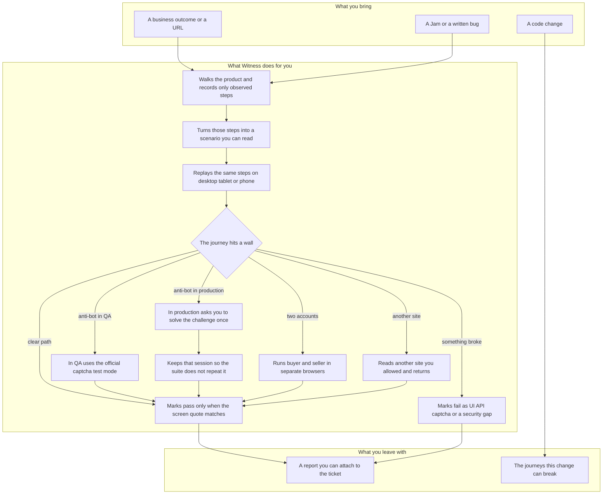

<p align="center">
  
</p>

<h1 align="center">Witness</h1>

<p align="center"><strong>See it. Test it. Prove it.</strong></p>

QA plugin for Cursor, Claude, and Codex. **The plugin has no application code.** The agent follows skills, writes **JSON** in the app under test, documents behavior in **Gherkin**, and executes in the browser with **Playwright MCP**.

Flow JSON stores pages, locators, and oracles. The `.feature` file is the exact journey: one `When` and one `Then` per observed step, in the same order. Gherkin is not a runner.

## How it helps QA

You describe the outcome. Witness walks the product, keeps only what it saw, and comes back with proof or a classified failure. It does not invent steps, and it does not rewrite the expected result to make a run green.



On an anti-bot wall, `/witness:captcha` detects the provider and **resolves** it. It does not solve image puzzles.

| Environment | Resolution |
|-------------|------------|
| local / staging `strategy: test` | Official provider test keys already configured in the app |
| `strategy: mock` | Documented mock or `oracle.network`; never a silent bypass on readonly production |
| persisted site + `reuseAcrossRuns` | Reload `storageState` or Chromium profile; skip a repeat human gate |
| production `strategy: human` | Pause, user completes the challenge in the live browser, Witness resumes |
| timeout or interactive puzzle | Run `blocked`; classification `captcha_unresolved` |

If the widget is shown and the API still accepts the request without server-side token validation, debug classifies `security_regression`.

## Contract

| Artifact | Role |
|----------|------|
| `witness.config.json` | Base URLs, surfaces, MCPs, `healing.assertions: never`, `captcha`, `sessions.sites`, `sites.crossSite`, `accounts` |
| `.witness/graph/flows/*.json` | Pages, ordered steps, `expect`, `oracle` (UI, HTTP, visual, captcha) |
| `features/*.feature` | Exact journey: one `When`/`Then` per observed step (not a runner) |
| `.witness/runs/*/result.json` | Pass, fail, or blocked; **evidence** required on pass and fail |
| `.witness/runs/*/failure.json` | Classification and `firstDivergence` (`ui`, `network`, or `captcha`) |
| `.witness/runs/*/captcha-state.json` | Provider, mode, status, confidence; no raw token in the flow |
| `.witness/sessions/` | Cookies, `localStorage`, session sidecar, or Chromium profile per site or account |
| `.witness/runs/*/actors/*/result.json` | One result per account when the flow declares `actors` |
| `.witness/runs/*/har-report.json` | Network entries vs `oracle.network`; mismatches first in HAR report |
| `.witness/graph/healing.json` | Append-only locator name history; assertions never heal |
| `.witness/graph/unknown-state.json` | Unexpected screen after captcha has been ruled out |

Templates and JSON Schemas live under `templates/`. Official doc URLs the agent must read before tools and flags: [`skills/witness/references/docs.md`](skills/witness/references/docs.md).

## Commands

| Command | What it does |
|---------|----------------|
| `/witness:init` | MCP interview, config, `.witness/` folders |
| `/witness:explore` | Observe a URL, write flow JSON, and the matching `.feature` |
| `/witness:map` | Summarize flows, scenarios, and unknown states |
| `/witness:spec` | `.feature` with one `When`/`Then` per observed step |
| `/witness:mission` | Business goal to flow; feature only if `expect` passed |
| `/witness:run` | Execute steps in order; `@critical` and `@smoke` filter |
| `/witness:captcha` | Detect anti-bot; test keys, session, or human gate |
| `/witness:repro` | Jam URL or narrative. On the machine when computer-control is connected; otherwise Playwright |
| `/witness:debug` | Write `failure.json` |
| `/witness:heal` | Change `action.names` only; log in `healing.json` |
| `/witness:gaps` | Missing steps and transitions |
| `/witness:report` | `kind` **scenarios** (default), **coverage** (graph gaps), or **har** (network vs oracle) |
| `/witness:affected` | `git diff` crossed with flow pages |

## Sessions, hops, and accounts

Session storage is per origin in `sessions.sites`. Default is `persist: false`.

| `include` | How it is stored |
|-----------|------------------|
| `cookies`, `localStorage` | `browser_storage_state` with `--caps=storage` |
| `sessionStorage` | Sidecar `.witness/sessions/{id}.session.json`, restored after navigation |
| `indexedDB`, `cache` | Chromium `--user-data-dir` under `.witness/sessions/profiles/{id}` when the MCP save tool has no IndexedDB flag |

Cross-site navigation is allowlisted. A step names `site` and `hop`. An origin outside `sites.allowlist` and the environment `baseUrl` blocks the step (`origin_not_allowlisted`).

Two accounts never share one browser context. A flow with `actors` runs one sub-agent per account (`concurrency: sub-agents`), each with its own profile. If the host cannot isolate the browser, the parent runs accounts one after another and records `sequential-fallback`. Collaborative flows wait on `.witness/runs/{id}/barriers/{barrierId}.json`.

## Rules

- Semantic-first: ARIA role and name, then stable attributes, then structure, vision last.
- Never mark `pass` without snapshot `evidence`.
- Never invent a step that is not in the flow JSON.
- Never heal `expect` or Gherkin `Then`.
- Never write secrets, cookies, tokens, or passwords into flow JSON, features, or config. Accounts point at session paths only.
- Never click captcha image grids or call a captcha-breaking service.
- Production `readonly`: no purchase, delete, or publish.

## Host setup

The plugin does not install runtimes for you. `/witness:init` checks the machine and shows the official command when something is missing. Details: [`skills/witness/references/setup.md`](skills/witness/references/setup.md).

| Tool | Needed for | Install |
|------|------------|---------|
| Node.js 18+ and `npx` | Playwright MCP | [nodejs.org](https://nodejs.org/) |
| Git | Which journeys a diff can break | [git-scm.com/downloads](https://git-scm.com/downloads) |
| Chromium | Default browser | `npx playwright install chromium` when the first run says it is missing ([Playwright browsers](https://playwright.dev/docs/browsers)) |
| Lightpanda | Optional fast headless browser | [One-liner](https://lightpanda.io/docs/run-locally/installation/one-liner) or [Docker](https://lightpanda.io/docs/run-locally/installation/docker). Playwright MCP still runs the steps, connected with `--cdp-endpoint` |
| Jam MCP | Bug context for `/witness:repro` | Add `"jam": { "url": "https://mcp.jam.dev/mcp" }` to MCP config; [Jam MCP for Cursor](https://jam.dev/docs/jam-mcp#cursor) |
| Computer Control | Fast proof on this machine, and native dialogs Playwright cannot see | [computer-control-mcp](https://github.com/AB498/computer-control-mcp) via `uvx computer-control-mcp@latest` when you accept it. If the tools are already connected, Witness uses them without asking again |
| ffmpeg | Video frames when Jam MCP or local file | [ffmpeg.org](https://ffmpeg.org/documentation.html) |

Lightpanda stays off until you accept it. One `lightpanda serve` is one browser, so two accounts still use separate Chromium profiles unless you start one serve per port. Do not put a cloud token in `witness.config.json`.

## Install

The plugin is this repository. Version `0.1.0` is in [`VERSION`](VERSION). License: [MIT](LICENSE). Privacy: [PRIVACY.md](PRIVACY.md).

### Cursor

Submit the public repository at [cursor.com/marketplace/publish](https://cursor.com/marketplace/publish). The manifest is [`.cursor-plugin/plugin.json`](.cursor-plugin/plugin.json). Logo path: `assets/logo.png`.

To try it before it is listed, copy this directory to `~/.cursor/plugins/local/witness` (a symlink that points outside that folder is ignored), then reload the window. Confirm the Witness skills, the `witness` agent, the session-start hook, and the Playwright MCP server under Customize.

### Claude Code

[`.claude-plugin/marketplace.json`](.claude-plugin/marketplace.json) lists this repo as the plugin source. From a shell:

```bash
claude plugin validate --strict .
claude plugin marketplace add gfrancodev/witness
claude plugin install witness@witness
```

One session only: `claude --plugin-dir /path/to/witness`. A release zip also loads with `--plugin-dir`.

### Codex

[`.agents/plugins/marketplace.json`](.agents/plugins/marketplace.json) is the repo catalog. From a shell:

```bash
codex plugin marketplace add gfrancodev/witness
```

Restart the ChatGPT desktop app, open the Plugins directory, choose the Witness marketplace, and install the plugin. The compatibility manifest is [`.codex-plugin/plugin.json`](.codex-plugin/plugin.json).

## What ships

| Piece | Path |
|-------|------|
| Skills | `skills/*/SKILL.md` |
| Agent | `agents/witness.md` |
| Cursor hook | `hooks/hooks-cursor.json` (`sessionStart` reads the hub skill) |
| MCP template | `agents/mcp.json` (Playwright and Jam) |
| Schemas and examples | `templates/` |
| Logo | `assets/logo.png` |

## Release

1. Bump [`VERSION`](VERSION) and the `version` field in each `plugin.json`.
2. Add the same version to [`CHANGELOG.md`](CHANGELOG.md).
3. Run `make test-plugin`.
4. Tag `vX.Y.Z` and push. The release workflow attaches `dist/witness-plugin_X.Y.Z.zip`.
5. Submit or update the Cursor listing, and publish the Claude and Codex listings from this repository.

Do not rename `witness` after the first install. Existing installs are stored under that name.

## Package check

```bash
./scripts/package-plugin.sh
make test-plugin
```
